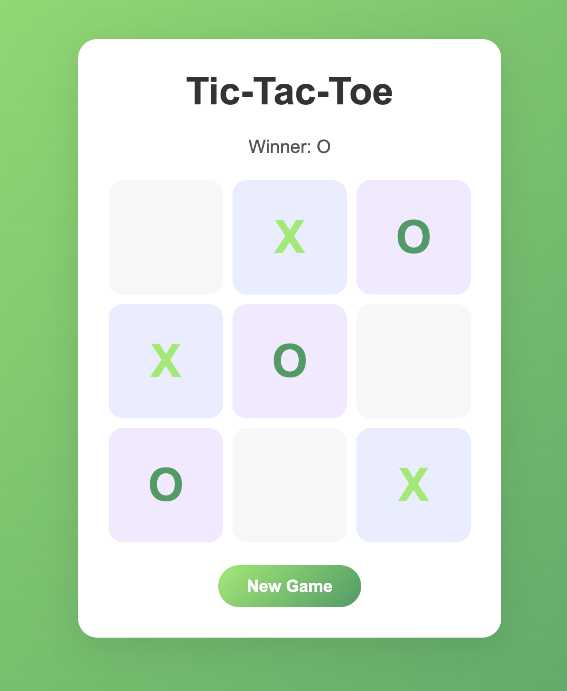

# Tic-Tac-Toe

A simple tic-tac-toe game with a Go backend and vanilla JavaScript frontend. Play against the computer in your browser.

## Features

- 🎮 Player vs Computer gameplay
- 🧠 Simple AI with basic strategy (win/block/center/corners)
- 🐳 Docker support
- 🎯 Graceful shutdown with OS signal handling
- ✅ Unit tests for game logic

## Tech Stack

- **Backend:** Go 1.24
- **Frontend:** HTML, CSS, Vanilla JavaScript
- **Containerization:** Docker, Docker Compose

## Quick Start

### Prerequisites

- Go 1.24+ or Docker

### Run locally

```bash
go run main.go
```
Open http://localhost:8080

---
### Run with Docker
```bash
docker-compose up -d --build
```
Open http://localhost:8080

### Stop Docker
```bash
docker-compose down
```